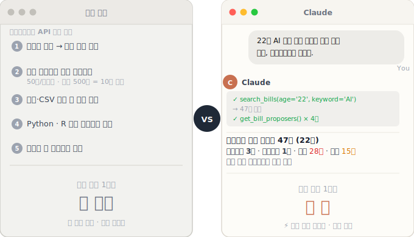
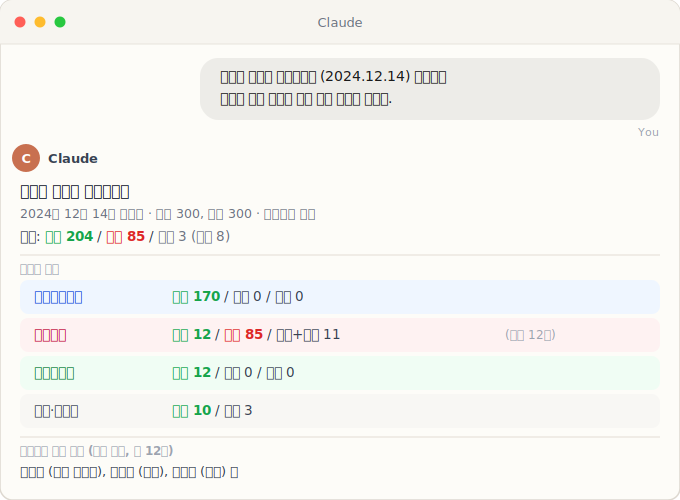

# open-assembly-mcp

[](https://pypi.org/project/open-assembly-mcp/)
[](https://github.com/kyusik-yang/open-assembly-mcp)
[](LICENSE)
[](https://www.python.org/)
[](tests/)
[](README.ko.md)

**MCP server for the Korean National Assembly Open API** ([열린국회정보](https://open.assembly.go.kr)) — query bills, members, vote results, committee composition, pending bills, plenary agenda, and per-member vote records directly from Claude or any MCP-compatible AI client.



---

## Demo

Ask Claude in natural language. Claude calls the right tools and chains them automatically.



---

## Connecting to Claude

There are three ways to use the Assembly tools, depending on which Claude interface you use.

**Before any setup:** Get a free API key at [open.assembly.go.kr](https://open.assembly.go.kr)
→ Sign up → 마이페이지 → API 키 발급

---

### Option 1 — Claude Desktop (Recommended)

Easiest path. The `--setup` wizard writes the config file for you.

**Prerequisites:** [Claude Desktop](https://claude.ai/download) must be installed.

```bash
uvx open-assembly-mcp --setup
```

It prompts for your key, validates it, and writes the config automatically. Then restart Claude Desktop.

**Manual config** (skip the wizard) — edit the Claude Desktop config file directly:

- **macOS**: `~/Library/Application Support/Claude/claude_desktop_config.json`
- **Windows**: `%APPDATA%\Claude\claude_desktop_config.json`

```json
{
  "mcpServers": {
    "open-assembly": {
      "command": "uvx",
      "args": ["open-assembly-mcp@latest"],
      "env": {
        "ASSEMBLY_API_KEY": "your-api-key-here"
      }
    }
  }
}
```

Save and restart Claude Desktop.

---

### Option 2 — Claude Code (CLI)

Best for researchers running Claude from the terminal. Three scope options:

```bash
# Local scope (default): stored in ~/.claude.json, applies only to the current project
claude mcp add open-assembly \
  --command uvx \
  --args "open-assembly-mcp@latest" \
  --env "ASSEMBLY_API_KEY=your-key-here"

# User scope: available across all your projects
claude mcp add open-assembly \
  --scope user \
  --command uvx \
  --args "open-assembly-mcp@latest" \
  --env "ASSEMBLY_API_KEY=your-key-here"

# Project scope: saved to .mcp.json at the project root (git-committable, good for team sharing)
claude mcp add open-assembly \
  --scope project \
  --command uvx \
  --args "open-assembly-mcp@latest" \
  --env "ASSEMBLY_API_KEY=your-key-here"
```

Verify it was added: `claude mcp list`

---

### Option 3 — Claude.ai web (claude.ai)

The claude.ai web interface **does not support locally-running MCP servers**. It only connects to remote, HTTP-based servers hosted on public infrastructure.

To use the Assembly tools from claude.ai, you would need to deploy the server publicly as a hosted HTTP endpoint. Use **Claude Desktop** or **Claude Code** instead.

---

## Usage Examples

Ask Claude in natural language (Korean or English). Claude chains the tools automatically.

---

### Scenario 1 — Find and filter bills in a policy domain

> **"22대 국회에서 발의된 인공지능 관련 법률안 목록을 찾아줘. 처리 결과별로 요약하고, 대안반영폐기된 법안 하나의 공동발의자도 알려줘."**

Claude calls:
1. `search_bills(age="22", bill_name="인공지능", page_size=50)` → 59 bills found
2. For a 대안반영폐기 bill: `get_bill_proposers(bill_id="PRC_...")` → co-sponsor list

**Sample output (real data, 2026-03):**
```
인공지능 관련 법률안 59건 (22대)

처리 결과:
  대안반영폐기  28건  ← 위원회 대안(인공지능기본법)으로 흡수
  계류 중       31건

최근 발의 법안:
  인공지능 발전과 신뢰 기반 조성 등에 관한 기본법 일부개정법률안  이상휘  2026-02-12
  중소기업 인공지능 전환 지원에 관한 법률안                      김종민  2026-02-09
  인공지능 데이터센터 진흥 및 기반 조성에 관한 법률안             김장겸  2026-02-04

대안반영폐기 법안 공동발의자:
  인공지능 발전과 신뢰 기반 조성 등에 관한 기본법 일부개정법률안 (최민희, 2025-09-05)
    최민희 (민주당), 허성무 (민주당), 김우영 (민주당), 박민규 (민주당),
    최혁진 (민주당), 양문석 (민주당), 김현 (민주당), 한민수 (민주당),
    노종면 (민주당), 조인철 (민주당)  총 10명
```

---

### Scenario 2 — Trace a single bill's full legislative journey

> **"인공지능기본법 (의안번호 2206772)의 입법 여정을 처음부터 끝까지 보여줘. 위원회 심사 일정, 본회의 표결 결과, 공포일까지 알려줘."**

Claude calls:
1. `get_bill_review(age="22", bill_no="2206772")` → committee + plenary timeline
2. `get_bill_detail(bill_no="2206772")` → full metadata + LINK_URL

**Sample output (real data, 2026-03):**
```
인공지능 발전과 신뢰 기반 조성 등에 관한 기본법안 (BILL_NO 2206772)
발의자: 과학기술정보방송통신위원장
소관위원회: 과학기술정보방송통신위원회

위원회 심사:
  2024-11-26  과기위 상정
  2024-11-26  과기위 의결 (원안가결)

본회의:
  2024-12-17  의결 — 찬성 260 / 반대 1 / 기권 3  (원안가결)
  2024-12-26  정부 이송
  2025-01-10  정부 이송 완료
  2025-01-21  공포

원문 링크: https://likms.assembly.go.kr/bill/billDetail.do?billId=PRC_R2V4H1W1T2K5M1O6E4Q9T0V7Q9S0U0
```

---

### Scenario 3 — Analyze party-line voting on a bill

> **"22대 국회에서 법원조직법 개정안 표결에서 각 정당 의원들은 어떻게 투표했나? 당론을 이탈한 의원이 있었나?"**

Claude calls:
1. `get_vote_results(age="22", bill_name="법원조직법")` → finds bill + aggregate counts + BILL_ID
2. `get_member_votes(bill_id="PRC_H2W6O0K2D1T1Y2B0O5J2K5Q5A8Z0Y3", age="22")` → 295 rows, one per member

**Sample output (real data, BILL_NO 2216843):**
```
법원조직법 일부개정법률안(대안)(법제사법위원장) (2026-02 의결)
전체: 찬성 173 / 반대 73 / 기권 1

정당별 표결:
  더불어민주당  찬성 152 / 기권 1  / 불참 9
  국민의힘     반대  70 / 불참 36
  조국혁신당   찬성  12
  진보당       찬성   4
  개혁신당     반대   2 / 불참 1
  무소속       찬성   3 / 불참 3

당론 이탈:
  민주당 기권 1명: 이학영 (경기 군포시)
```

---

### Scenario 4 — Profile a single member's legislative activity

> **"이준석 의원 (22대)의 입법 활동을 요약해줘. 어떤 법안을 발의했고, 최근 표결에서 여당 vs 야당 법안에 어떻게 투표했나?"**

Claude calls:
1. `get_member_info(age="22", name="이준석")` → party, district, committee
2. `search_bills(age="22", proposer="이준석", page_size=100)` → all sponsored bills
3. `get_vote_results(age="22", page_size=20)` → recent voted bills
4. `get_member_votes(bill_id=..., age="22", member_name="이준석")` × 20 bills

**Sample output (real data, 2026-03):**
```
이준석 (개혁신당 | 경기 화성시을 | 22대)
소속 위원회: 과학기술정보방송통신위원회

발의 법안: 총 14건
  대안반영폐기 1건 / 계류 중 13건

최근 발의 법안:
  전자상거래 등에서의 소비자보호에 관한 법률 일부개정법률안  2026-02-25
  정보통신망 이용촉진 및 정보보호 등에 관한 법률 일부개정법률안  2026-02-05
  소득세법 일부개정법률안  2025-08-19

최근 표결 50건:
  찬성 13 / 불참 37
```

---

### Scenario 5 — Check pending legislation in a committee

> **"과학기술정보방송통신위원회에 현재 계류 중인 법안은 몇 개야? AI·반도체 관련 법안만 따로 봐줘."**

Claude calls:
1. `get_pending_bills(age="22", committee="과학기술정보방송통신위원회", page_size=100)` → 12,505 bills
2. `get_pending_bills(age="22", committee="과학기술정보방송통신위원회", bill_name="인공지능")` → 31 AI bills

**Sample output (real data, 2026-03):**
```
과기위 계류의안: 총 12,505건 (2026-03 기준)

AI·반도체 관련 (키워드 필터):
  인공지능 관련   31건
  반도체 관련      3건

인공지능 관련 최근 발의:
  인공지능 발전과 신뢰 기반 조성 등에 관한 기본법 일부개정법률안  이상휘   2026-02-12
  중소기업 인공지능 전환 지원에 관한 법률안                      김종민   2026-02-09
  국방인공지능법안                                              유용원·부승찬  2026-01-27
```

---

### Scenario 6 — Check what's on the next plenary agenda

> **"다음 본회의에 상정될 법안 목록을 알려줘."**

Claude calls:
1. `get_plenary_agenda(age="22", page_size=30)` → upcoming agenda items

**Sample output (real data, 2026-03):**
```
본회의 부의안건 (22대, 조회일 기준 최신)

총 101건:
  1. [기후에너지환경노동위원회] 산업안전보건법 일부개정법률안(대안)  (2216964)
  2. [기후에너지환경노동위원회] 환경오염시설의 통합관리에 관한 법률 일부개정법률안(대안)  (2216963)
  3. [기후에너지환경노동위원회] 노동감독관 직무집행법안(대안)  (2216962)
  4. [기후에너지환경노동위원회] 산업재해보상보험법 일부개정법률안(대안)  (2216961)
  5. [기후에너지환경노동위원회] 근로기준법 일부개정법률안(대안)  (2216960)
  6. [정보위원회] 국가정보원직원법 일부개정법률안(대안)  (2216812)
  7. [기후위기 특별위원회] 기후위기 대응을 위한 탄소중립·녹색성장 기본법 일부개정법률안(대안)  (2216802)
  ...
```

---

## Available Tools

All tools return `total_count` and `has_more` for transparent pagination.

### Quick Reference

| Tool | Key parameters | Returns |
|---|---|---|
| `search_bills` | `age`, `bill_name`, `proposer`, `proc_result`, `committee`, `propose_dt_from/to` | `bills[]`, `total_count`, `has_more` |
| `get_bill_detail` | `bill_no` (BILL_NO) | `bill{}` |
| `get_bill_review` | `age`, `bill_no`, `committee` | `reviews[]`, `total_count`, `has_more` |
| `get_bill_proposers` | `bill_id` (BILL_ID) | `proposers[]` |
| `get_bill_committee_review` | `bill_id` (BILL_ID) | `meetings[]` |
| `get_member_info` | `age`, `name`, `party`, `district`, `committee` | `members[]`, `total_count`, `has_more` |
| `get_committee_members` | `age`, `committee` | `members[]`, `total_count`, `has_more` |
| `get_vote_results` | `age`, `bill_no`, `bill_name` | `votes[]` with `YES_TCNT`, `NO_TCNT`, `BLANK_TCNT`, `BILL_ID` |
| `get_member_votes` | `bill_id` (BILL_ID), `age`, `member_name`, `party`, `vote_result` | `votes[]` with per-member `RESULT_VOTE_MOD` |
| `get_pending_bills` | `age`, `bill_name`, `committee`, `proposer` | `bills[]`, `total_count`, `has_more` |
| `get_plenary_agenda` | `age`, `session` | `agenda_items[]`, `total_count`, `has_more` |

> **BILL_ID vs BILL_NO** — many tools need `BILL_ID` (the internal ID, starts with `PRC_...`),
> not `BILL_NO` (the public 7-digit number like `2216983`). Both are returned by `search_bills`
> and `get_pending_bills`. Tools that need `BILL_ID`: `get_bill_proposers`,
> `get_member_votes`, `get_bill_committee_review`.

### Coverage by Assembly

| Tool | Reliable range | Notes |
|---|---|---|
| `search_bills` | 16th–22nd | Member-sponsored bills only (no government bills) |
| `get_bill_detail` | 16th–22nd | |
| `get_bill_review` | 16th–22nd | |
| `get_member_info` | 16th–22nd | |
| `get_committee_members` | 16th–22nd | |
| `get_vote_results` | 19th–22nd recommended | Electronic vote records sparse before 19th Assembly |
| `get_member_votes` | 18th–22nd recommended | Roll-call data from ~18th Assembly onward; default page_size=300 fetches all ~300 members in one call |
| `get_bill_proposers` | 16th–22nd | |
| `get_pending_bills` | 22nd recommended | Bills not yet processed; ~8,900 in the 22nd Assembly |
| `get_plenary_agenda` | 22nd recommended | Bills scheduled for the next plenary session |
| `get_bill_committee_review` | 16th–22nd | Committee meetings for a specific bill |
| `get_bill_summary` | 16th–22nd | **Convenience** — chains detail + review + proposers + committee meetings in one call |

**Not available via Open API**: transcripts, citizen petitions, bill full text
(use `get_bill_detail` → `LINK_URL` for the official bill page).

---

## Updating

`uvx` caches packages locally. If you installed a previous version, force a reinstall to get the latest:

```bash
uvx --reinstall open-assembly-mcp --setup
```

To update the server used by Claude Desktop, edit your config and change the `args` line to pin the new version, or leave it as `open-assembly-mcp@latest` to always pull the latest on startup.

---


## Why this exists

The Korean National Assembly's [열린국회정보 API](https://open.assembly.go.kr) provides rich legislative data — every member-sponsored bill since 2000, full member rosters, plenary vote tallies, committee review timelines, and co-sponsor networks. The data is invaluable for political science research, but the traditional retrieval workflow is slow:

```
Traditional: search site manually → copy data → clean → load into Python/R
             → hours of overhead per research question

With MCP:    ask Claude in one sentence → tools chain automatically → results in seconds
```

**Concrete research use cases:**

| Task | Tools used |
|---|---|
| Co-sponsorship network for a policy domain | `search_bills` + `get_bill_proposers` |
| Party-line discipline on a specific vote | `get_vote_results` + `get_member_votes` (party filter) |
| Cross-party voting coalitions | `get_vote_results` + `get_member_votes` |
| Full legislative career of a single member | `search_bills` (proposer filter) + `get_member_votes` |
| Committee composition by party | `get_committee_members` |
| Bill timeline from filing to promulgation | `get_bill_review` + `get_bill_committee_review` + `get_bill_detail` |
| Currently active legislation in a policy area | `get_pending_bills` (committee/keyword filter) |
| Upcoming plenary votes | `get_plenary_agenda` |
| Majority-building analysis for a passed bill | `get_bill_proposers` + `get_member_votes` |

---

## Local Development

```bash
git clone https://github.com/kyusik-yang/open-assembly-mcp.git
cd open-assembly-mcp

cp .env.example .env        # add ASSEMBLY_API_KEY=your-key

uv sync --group dev
uv run pytest tests/ -v
```

```bash
# Run the server locally
ASSEMBLY_API_KEY=your-key uv run python -m data_go_mcp.open_assembly.server
```

---

## Changelog

### v0.2.7 (2026-03)
- Replaced all placeholder examples ("홍길동", "김OO", etc.) in README with real API query results
- Updated scenario outputs with verified live data: 인공지능기본법 journey, 법원조직법 party-line vote, 이준석 profile, 과기위 pending bills, plenary agenda

### v0.2.6 (2026-03)
- Added `get_bill_summary` convenience tool: chains detail + review + proposers + committee meetings in one parallel call
- Rewrote all 12 tool docstrings with When-to-use, workflow hints, and BILL_ID vs BILL_NO disambiguation
- Added explicit `TimeoutException` handling in API client (descriptive error message)
- Added `test_client.py` coverage for 3 new endpoints + timeout handling (36 → 46 tests)

### v0.2.5 (2026-03)
- Added 3 new tools: `get_pending_bills` (계류의안), `get_plenary_agenda` (본회의부의안건), `get_bill_committee_review` (위원회 심사 회의정보)
- Fixed `get_member_votes` default `page_size` 50 → 300 (covers full ~300-member plenary in one call)
- Improved docstrings: corrected `get_vote_results` description, added pagination tips to all tools

### v0.2.4 (2026-03)
- `--setup` wizard: ASCII art banner with teal-to-blue gradient, animated validation, polished bilingual prompts

### v0.2.3 (2026-03)
- `--setup` wizard: ANSI colors, box-drawing header, professional bilingual prompts

### v0.2.2 (2026-03)
- `--setup` wizard: bilingual prompts (EN/KR), academic contact info

### v0.2.1 (2026-03)
- Added `--setup` wizard: interactive installer that auto-configures Claude Desktop

### v0.2.0 (2026-03)
- Added `get_member_votes` — per-member roll-call records for any bill
- All tools now return `total_count` and `has_more` for transparent pagination
- Added `propose_dt_from` / `propose_dt_to` date filter to `search_bills`
- Extended coverage to 16th and 17th Assemblies

### v0.1.0 (2026-02)
- Initial release

---

## License

Apache 2.0. See [LICENSE](LICENSE).

> This project was built following the architecture of [Koomook/data-go-mcp-servers](https://github.com/Koomook/data-go-mcp-servers). The server structure, packaging conventions, and API client pattern are adapted from that project under the Apache 2.0 license.

*Not affiliated with or endorsed by the Korean National Assembly or open.assembly.go.kr.*

---

*Built with [Claude Code](https://claude.ai/code) — because the best way to make an AI tool for querying a legislature is to have an AI write it.*
