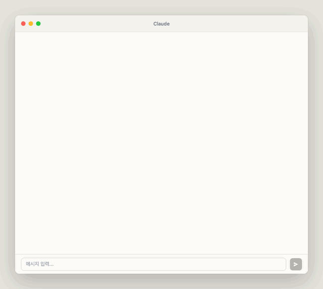
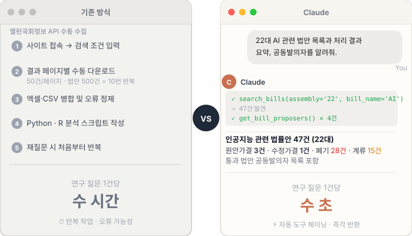

# open-assembly-mcp

[](https://pypi.org/project/open-assembly-mcp/)
[](https://github.com/kyusik-yang/open-assembly-mcp)
[](LICENSE)
[](https://www.python.org/)
[](tests/)
[](README.ko.md)

**MCP server for the Korean National Assembly Open API** ([열린국회정보](https://open.assembly.go.kr)) — query bills, members, vote results, committee composition, pending bills, plenary agenda, per-member vote records, NARS reports, petitions, schedule, and hearings directly from Claude or any MCP-compatible AI client.

---

## Showcase

한국어나 영어로 자연스럽게 질문하면 됩니다. Claude가 필요한 툴을 고르고 체인으로 연결합니다.





---

### 1 — 당론 분석

> **"22대 법원조직법 표결, 정당별 찬반 집계와 이탈표 알려줘"**

Claude calls `get_vote_results` → `get_party_cohesion`

```
법원조직법 일부개정법률안(대안) — 2026-02 의결
전체: 찬성 173 / 반대 73 / 기권 1

정당별 표결:
  더불어민주당  찬성 152 / 기권 1 / 불참 9
  국민의힘     반대  70 / 불참 36
  조국혁신당   찬성  12
  진보당       찬성   4
  개혁신당     반대   2 / 불참 1
  무소속       찬성   3 / 불참 3

이탈표:
  이학영 (더불어민주당 | 경기 군포시) — 기권
```

---

### 2 — 의원 의정활동 전체를 한 번에

> **"이준석 의원 22대 발의 법안 전부 통계내줘"**

Claude calls `analyze_legislator(name="이준석", assembly="22")` — 툴 호출 1번, 최대 500건 자동 페이지네이션

```
이준석 (개혁신당 | 경기 화성시을 | 22대)
소속: 과학기술정보방송통신위원회

발의 법안: 총 14건
  처리 결과: 계류 중 13건 / 대안반영폐기 1건
  위원회별:  과학기술정보방송통신위원회 14건

최근 발의 (5건):
  전자상거래 등에서의 소비자보호에 관한 법률 일부개정법률안     2026-02-25
  정보통신망 이용촉진 및 정보보호 등에 관한 법률 일부개정법률안  2026-02-05
  소득세법 일부개정법률안                                       2025-08-19
  전기통신사업법 일부개정법률안                                  2025-08-06
  공공기관의 운영에 관한 법률 일부개정법률안                      2025-07-10
```

---

### 3 — 법안 입법 여정 전체

> **"인공지능기본법 (의안번호 2206772) 입법 과정 처음부터 끝까지 보여줘"**

Claude calls `get_bill_summary(assembly="22", bill_no="2206772")` — 상세정보·심사정보·발의자·위원회회의 4개 서브호출 병렬 실행

```
인공지능 발전과 신뢰 기반 조성 등에 관한 기본법안 (BILL_NO 2206772)
발의: 과학기술정보방송통신위원장

위원회 심사:
  2024-11-26  과학기술정보방송통신위원회 상정
  2024-11-26  과학기술정보방송통신위원회 의결 (원안가결)

본회의:
  2024-12-17  의결 — 찬성 260 / 반대 1 / 기권 3
  2025-01-21  공포

원문: https://likms.assembly.go.kr/bill/billDetail.do?billId=PRC_R2V4H1W1T2K5M1O6E4Q9T0V7Q9S0U0
```

---

## Connecting to Claude

There are three ways to use the Assembly tools, depending on which Claude interface you use.

**Before any setup:** Get a free API key at [open.assembly.go.kr](https://open.assembly.go.kr)
→ Sign up → 마이페이지 → API 키 발급

---

### Option 1 — Claude Desktop (Recommended)

Easiest path. The `--setup` wizard writes the config file for you.

**Prerequisites:** [Claude Desktop](https://claude.ai/download) must be installed.

```bash
uvx open-assembly-mcp --setup
```

It prompts for your key, validates it, and writes the config automatically. Then restart Claude Desktop.

**Manual config** (skip the wizard) — edit the Claude Desktop config file directly:

- **macOS**: `~/Library/Application Support/Claude/claude_desktop_config.json`
- **Windows**: `%APPDATA%\Claude\claude_desktop_config.json`

```json
{
  "mcpServers": {
    "open-assembly": {
      "command": "uvx",
      "args": ["open-assembly-mcp@latest"],
      "env": {
        "ASSEMBLY_API_KEY": "your-api-key-here"
      }
    }
  }
}
```

Save and restart Claude Desktop.

---

### Option 2 — Claude Code (CLI)

Best for researchers running Claude from the terminal. Three scope options:

```bash
# Local scope (default): stored in ~/.claude.json, applies only to the current project
claude mcp add open-assembly \
  --command uvx \
  --args "open-assembly-mcp@latest" \
  --env "ASSEMBLY_API_KEY=your-key-here"

# User scope: available across all your projects
claude mcp add open-assembly \
  --scope user \
  --command uvx \
  --args "open-assembly-mcp@latest" \
  --env "ASSEMBLY_API_KEY=your-key-here"

# Project scope: saved to .mcp.json at the project root (git-committable, good for team sharing)
claude mcp add open-assembly \
  --scope project \
  --command uvx \
  --args "open-assembly-mcp@latest" \
  --env "ASSEMBLY_API_KEY=your-key-here"
```

Verify it was added: `claude mcp list`

---

### Option 3 — Claude.ai web (claude.ai)

The claude.ai web interface **does not support locally-running MCP servers**. It only connects to remote, HTTP-based servers hosted on public infrastructure.

To use the Assembly tools from claude.ai, you would need to deploy the server publicly as a hosted HTTP endpoint. Use **Claude Desktop** or **Claude Code** instead.

---

## More Examples

위 [Showcase](#showcase) 외 추가 시나리오입니다.

---

### Scenario 1 — Find and filter bills in a policy domain

> **"22대 국회에서 발의된 인공지능 관련 법률안 목록을 찾아줘. 처리 결과별로 요약하고, 대안반영폐기된 법안 하나의 공동발의자도 알려줘."**

Claude calls:
1. `search_bills(assembly="22", bill_name="인공지능", page_size=50)` → 59 bills found
2. For a 대안반영폐기 bill: `get_bill_proposers(bill_id="PRC_...")` → co-sponsor list

**Sample output (real data, 2026-03):**
```
인공지능 관련 법률안 59건 (22대)

처리 결과:
  대안반영폐기  28건  ← 위원회 대안(인공지능기본법)으로 흡수
  계류 중       31건

최근 발의 법안:
  인공지능 발전과 신뢰 기반 조성 등에 관한 기본법 일부개정법률안  이상휘  2026-02-12
  중소기업 인공지능 전환 지원에 관한 법률안                      김종민  2026-02-09
  인공지능 데이터센터 진흥 및 기반 조성에 관한 법률안             김장겸  2026-02-04

대안반영폐기 법안 공동발의자:
  인공지능 발전과 신뢰 기반 조성 등에 관한 기본법 일부개정법률안 (최민희, 2025-09-05)
    최민희 (민주당), 허성무 (민주당), 김우영 (민주당), 박민규 (민주당),
    최혁진 (민주당), 양문석 (민주당), 김현 (민주당), 한민수 (민주당),
    노종면 (민주당), 조인철 (민주당)  총 10명
```

---

### Scenario 2 — Trace committee and plenary steps separately

> **"인공지능기본법 (의안번호 2206772)의 위원회 심사 경로와 본회의 표결 일정을 각각 보여줘."**

Claude calls:
1. `get_bill_review(assembly="22", bill_no="2206772")` → committee + plenary timeline
2. `get_bill_detail(bill_no="2206772")` → full metadata + LINK_URL

**Sample output (real data, 2026-03):**
```
인공지능 발전과 신뢰 기반 조성 등에 관한 기본법안 (BILL_NO 2206772)
발의자: 과학기술정보방송통신위원장
소관위원회: 과학기술정보방송통신위원회

위원회 심사:
  2024-11-26  과기위 상정
  2024-11-26  과기위 의결 (원안가결)

본회의:
  2024-12-17  의결 — 찬성 260 / 반대 1 / 기권 3  (원안가결)
  2024-12-26  정부 이송
  2025-01-10  정부 이송 완료
  2025-01-21  공포

원문 링크: https://likms.assembly.go.kr/bill/billDetail.do?billId=PRC_R2V4H1W1T2K5M1O6E4Q9T0V7Q9S0U0
```

---

### Scenario 3 — Check pending legislation in a committee

> **"과학기술정보방송통신위원회에 현재 계류 중인 법안은 몇 개야? AI·반도체 관련 법안만 따로 봐줘."**

Claude calls:
1. `get_pending_bills(assembly="22", committee="과학기술정보방송통신위원회", page_size=100)` → 12,505 bills
2. `get_pending_bills(assembly="22", committee="과학기술정보방송통신위원회", bill_name="인공지능")` → 31 AI bills

**Sample output (real data, 2026-03):**
```
과기위 계류의안: 총 12,505건 (2026-03 기준)

AI·반도체 관련 (키워드 필터):
  인공지능 관련   31건
  반도체 관련      3건

인공지능 관련 최근 발의:
  인공지능 발전과 신뢰 기반 조성 등에 관한 기본법 일부개정법률안  이상휘   2026-02-12
  중소기업 인공지능 전환 지원에 관한 법률안                      김종민   2026-02-09
  국방인공지능법안                                              유용원·부승찬  2026-01-27
```

---

### Scenario 4 — Check what's on the next plenary agenda

> **"다음 본회의에 상정될 법안 목록을 알려줘."**

Claude calls:
1. `get_plenary_agenda(assembly="22", page_size=30)` → upcoming agenda items

**Sample output (real data, 2026-03):**
```
본회의 부의안건 (22대, 조회일 기준 최신)

총 101건:
  1. [기후에너지환경노동위원회] 산업안전보건법 일부개정법률안(대안)  (2216964)
  2. [기후에너지환경노동위원회] 환경오염시설의 통합관리에 관한 법률 일부개정법률안(대안)  (2216963)
  3. [기후에너지환경노동위원회] 노동감독관 직무집행법안(대안)  (2216962)
  4. [기후에너지환경노동위원회] 산업재해보상보험법 일부개정법률안(대안)  (2216961)
  5. [기후에너지환경노동위원회] 근로기준법 일부개정법률안(대안)  (2216960)
  6. [정보위원회] 국가정보원직원법 일부개정법률안(대안)  (2216812)
  7. [기후위기 특별위원회] 기후위기 대응을 위한 탄소중립·녹색성장 기본법 일부개정법률안(대안)  (2216802)
  ...
```

---

## Available Tools

All tools return `total_count` and `has_more` for transparent pagination.

### Quick Reference

**Core tools** (dedicated to common legislative research workflows):

| Tool | Key parameters | Returns |
|---|---|---|
| `search_bills` | `assembly`, `bill_name`, `proposer`, `proc_result`, `committee`, `propose_dt_from/to` | `bills[]`, `total_count`, `has_more` |
| `get_bill_detail` | `bill_no` (BILL_NO) | `bill{}` |
| `get_bill_review` | `assembly`, `bill_no`, `committee` | `reviews[]`, `total_count`, `has_more` |
| `get_bill_proposers` | `bill_id` (BILL_ID) | `proposers[]` |
| `get_bill_committee_review` | `bill_id` (BILL_ID) | `meetings[]` |
| `get_member_info` | `assembly`, `name`, `party`, `district`, `committee` | `members[]`, `total_count`, `has_more` |
| `get_committee_members` | `assembly`, `committee` | `members[]`, `total_count`, `has_more` |
| `get_vote_results` | `assembly`, `bill_no`, `bill_name` | `votes[]` with `YES_TCNT`, `NO_TCNT`, `BLANK_TCNT`, `BILL_ID` |
| `get_member_votes` | `bill_id` (BILL_ID), `assembly`, `member_name`, `party`, `vote_result` | `votes[]` with per-member `RESULT_VOTE_MOD` |
| `get_pending_bills` | `assembly`, `bill_name`, `committee`, `proposer` | `bills[]`, `total_count`, `has_more` |
| `get_plenary_agenda` | `assembly`, `session` | `agenda_items[]`, `total_count`, `has_more` |
| `get_bill_summary` | `assembly`, `bill_no` | `detail{}`, `review{}`, `proposers[]`, `committee_meetings[]` |

**Chain & research tools** (compound queries and computed metrics):

| Tool | Key parameters | Returns |
|---|---|---|
| `analyze_legislator` | `name`, `assembly` | `member{}`, `bills{total, by_result, by_committee, by_year, recent, all}` |
| `get_party_cohesion` | `bill_id` (BILL_ID), `assembly` | `by_party{}` with per-party vote counts + dominant position, `dissenters[]` |

**API expansion tools** (NARS, petitions, schedule, hearings — new in v0.6.0):

| Tool | Key parameters | Returns |
|---|---|---|
| `search_nars_reports` | `keyword`, `date_from`, `date_to`, `page`, `page_size` | `reports[]`, `total_count`, `has_more` |
| `search_petitions` | `assembly`, `keyword`, `include_closed`, `page`, `page_size` | `petitions[]`, `total_count`, `has_more` |
| `get_schedule` | `assembly`, `schedule_type` (all/plenary/committee), `committee`, `page`, `page_size` | `schedule[]`, `total_count`, `has_more` |
| `search_hearings` | `assembly`, `hearing_type` (confirmation/public), `nominee_name`, `committee` | `hearings[]`, `total_count`, `has_more` |

**Universal access tools** (reach any of the 276+ endpoints not yet covered above):

| Tool | Key parameters | Returns |
|---|---|---|
| `discover_apis` | `keyword` (optional) | Verified endpoint registry, grouped by category |
| `query_assembly` | `endpoint_code`, `params` (dict), `page`, `page_size` | `rows[]`, `total_count`, `raw_response` |

> `discover_apis` → find an endpoint code → `query_assembly` → call it directly.

> **BILL_ID vs BILL_NO** — many tools need `BILL_ID` (the internal ID, starts with `PRC_...`),
> not `BILL_NO` (the public 7-digit number like `2216983`). Both are returned by `search_bills`
> and `get_pending_bills`. Tools that need `BILL_ID`: `get_bill_proposers`,
> `get_member_votes`, `get_bill_committee_review`.

### Universal Access: discover_apis + query_assembly

The 18 dedicated tools cover the most common legislative research workflows.
For anything not yet wrapped — NABO budget analyses, press releases, or any of the 276+
total endpoints — use the two universal access tools.

**Step 1: find the endpoint**

```
"열린국회 API에서 청원 관련 엔드포인트를 찾아줘"
```

Claude calls `discover_apis(keyword="청원")` and returns matching codes with descriptions.

**Step 2: call it**

```
"22대 국회 청원 현황 조회해줘"
```

Claude calls `query_assembly(endpoint_code="<code>", params={"AGE": "22"})`.

For the full catalog of 276+ endpoints:
https://open.assembly.go.kr/portal/data/service/selectAPIServicePage.do

---

### Coverage by Assembly

| Tool | Reliable range | Notes |
|---|---|---|
| `search_bills` | 16th–22nd | Member-sponsored bills only (no government bills) |
| `get_bill_detail` | 16th–22nd | |
| `get_bill_review` | 16th–22nd | |
| `get_member_info` | 16th–22nd | |
| `get_committee_members` | 16th–22nd | |
| `get_vote_results` | 19th–22nd recommended | Electronic vote records sparse before 19th Assembly |
| `get_member_votes` | 18th–22nd recommended | Roll-call data from ~18th Assembly onward; default page_size=300 fetches all ~300 members in one call |
| `get_bill_proposers` | 16th–22nd | |
| `get_pending_bills` | 22nd recommended | Bills not yet processed; ~8,900 in the 22nd Assembly |
| `get_plenary_agenda` | 22nd recommended | Bills scheduled for the next plenary session |
| `get_bill_committee_review` | 16th–22nd | Committee meetings for a specific bill |
| `get_bill_summary` | 16th–22nd | **Convenience** — chains detail + review + proposers + committee meetings in one call |
| `analyze_legislator` | 16th–22nd | **Chain** — member profile + all sponsored bills + career stats (by_result, by_year, by_committee) |
| `get_party_cohesion` | 18th–22nd recommended | **Research** — per-party vote breakdown + dissenters; requires BILL_ID from get_vote_results |
| `search_nars_reports` | All | NARS research reports by keyword or date range |
| `search_petitions` | 16th–22nd | Pending or all-time petitions; `include_closed=True` for closed petitions |
| `get_schedule` | All | Assembly schedule — all, plenary-only, or committee-specific |
| `search_hearings` | 16th–22nd | Personnel confirmation hearings or public hearings |
| `discover_apis` | All | Searches the verified endpoint registry; use before `query_assembly` |
| `query_assembly` | All | Universal fallback — calls any of the 276+ endpoints directly |

**Not available via Open API**: transcripts, citizen petitions, bill full text.
For bill texts and transcripts, see [Related Data Packages](#related-data-packages) below.
For official bill pages, use `get_bill_detail` → `LINK_URL`.

---

## Related Data Packages

This MCP server queries the [열린국회정보 API](https://open.assembly.go.kr) in real time. For data not available through the API, companion packages provide pre-collected datasets:

| Package | Data | Scale | Install |
|---------|------|-------|---------|
| [**kna**](https://github.com/kyusik-yang/kna) | Master bill database, roll call votes, DW-NOMINATE ideal points, bill texts | 110K bills, 2.4M votes (17th-22nd) | `pip install kna` |
| [**korean-assembly-bills**](https://github.com/kyusik-yang/korean-assembly-bills) | Bill propose-reason texts (제안이유), co-sponsor records, MP metadata | 60,925 bills (20th-22nd) | `pip install korean-assembly-bills` |
| [**kr-hearings-data**](https://github.com/kyusik-yang/kr-hearings-data) | Committee proceeding speeches, legislator-witness Q&A dyads | 9.9M speeches, 7.9M dyads (16th-22nd) | `pip install kr-hearings-data` |
| [**minister-data**](https://github.com/kyusik-yang/minister-data) | Cabinet minister panel with dual-office (겸직) coding | 286 appointments (2000-2025) | [CSV on GitHub](https://github.com/kyusik-yang/minister-data) |
| [**assemblykor**](https://github.com/kyusik-yang/assemblykor) | Curated teaching datasets (bills, votes, wealth, speeches) | R package, 7 datasets | `remotes::install_github("kyusik-yang/assemblykor")` |

**Quick rule**: Use **this MCP** for real-time lookups and exploratory queries via Claude. Use **kna** for offline statistical analysis and reproducible research in Python/R.

| You need... | Use |
|-------------|-----|
| Real-time bill metadata, vote tallies, member roster | **This MCP** (live API) |
| Pending bills, plenary agenda (time-sensitive) | **This MCP** (live API) |
| Offline master database, roll calls, DW-NOMINATE ideal points | [kna](https://github.com/kyusik-yang/kna) |
| Bill propose-reason text (제안이유) | [korean-assembly-bills](https://github.com/kyusik-yang/korean-assembly-bills) |
| Committee hearing transcripts, speech-level data | [kr-hearings-data](https://github.com/kyusik-yang/kr-hearings-data) |
| Legislator-witness Q&A pairs for oversight research | [kr-hearings-data](https://github.com/kyusik-yang/kr-hearings-data) dyads |
| Cabinet minister dual-office status | [minister-data](https://github.com/kyusik-yang/minister-data) |
| Teaching quantitative methods with Korean politics data | [assemblykor](https://github.com/kyusik-yang/assemblykor) (R) |

---

## Updating

`uvx` caches packages locally. If you installed a previous version, force a reinstall to get the latest:

```bash
uvx --reinstall open-assembly-mcp --setup
```

To update the server used by Claude Desktop, edit your config and change the `args` line to pin the new version, or leave it as `open-assembly-mcp@latest` to always pull the latest on startup.

---


## Why this exists

The Korean National Assembly's [열린국회정보 API](https://open.assembly.go.kr) provides rich legislative data — every member-sponsored bill since 2000, full member rosters, plenary vote tallies, committee review timelines, and co-sponsor networks. The data is invaluable for political science research, but the traditional retrieval workflow is slow:

```
Traditional: search site manually → copy data → clean → load into Python/R
             → hours of overhead per research question

With MCP:    ask Claude in one sentence → tools chain automatically → results in seconds
```

**Concrete research use cases:**

| Task | Tools used |
|---|---|
| Co-sponsorship network for a policy domain | `search_bills` + `get_bill_proposers` |
| Party-line discipline on a specific vote | `get_vote_results` + **`get_party_cohesion`** |
| Per-party vote breakdown + dissenters | **`get_party_cohesion`** → `by_party[party]` + `dissenters[]` |
| Cross-party voting coalitions | `get_vote_results` + `get_member_votes` |
| Full legislative career of a single member | **`analyze_legislator`** (one call) |
| Legislator activity by year or committee | **`analyze_legislator`** → `bills.by_year`, `bills.by_committee` |
| Committee composition by party | `get_committee_members` |
| Bill timeline from filing to promulgation | `get_bill_summary` or `get_bill_review` + `get_bill_committee_review` + `get_bill_detail` |
| Currently active legislation in a policy area | `get_pending_bills` (committee/keyword filter) |
| Upcoming plenary votes | `get_plenary_agenda` |
| Majority-building analysis for a passed bill | `get_bill_proposers` + `get_member_votes` |
| Confirmation hearing list by nominee or committee | **`search_hearings`** (hearing_type="confirmation") |
| NARS research reports on a policy topic | **`search_nars_reports`** (keyword) |
| Petitions received in a given assembly | **`search_petitions`** (assembly, include_closed) |
| Bill propose-reason text analysis | `search_bills` (this MCP) + [korean-assembly-bills](https://github.com/kyusik-yang/korean-assembly-bills) for texts |
| Committee oversight speech patterns | [kr-hearings-data](https://github.com/kyusik-yang/kr-hearings-data) speeches |
| Confirmation hearing Q&A transcripts | [kr-hearings-data](https://github.com/kyusik-yang/kr-hearings-data) with hearing_type filter |

---

## Research-first design

The only other MCP server for 열린국회 API is [hollobit/assembly-api-mcp](https://github.com/hollobit/assembly-api-mcp) (TypeScript, MIT). That project offers a clean universal query interface — call any of the 276+ endpoints by code, get back raw rows. This project extends that model with domain-specific tools built around the actual structure of legislative research.

| | hollobit/assembly-api-mcp | **open-assembly-mcp** |
|--|--|--|
| Language | TypeScript | Python |
| Dedicated tools | None (universal query only) | 14 dedicated + 4 expansion + 2 universal |
| Research metrics | None | Party cohesion, career stats built-in |
| Party cohesion | Manual aggregation from raw rows | `get_party_cohesion` — one call |
| Legislator profile | Multi-step manual | `analyze_legislator` — one call, 500-bill auto-pagination |
| Bill timeline | Manual chaining | `get_bill_summary` — parallel sub-calls |
| Historical accuracy | Current assembly only | `ALLNAMEMBER` — correct party/district per assembly |
| BILL_ID vs BILL_NO | Not distinguished | Explicit in all relevant tools |
| Test coverage | None | 106 pytest |

### What this means in practice

**`get_party_cohesion`** takes a BILL_ID and returns the full picture for that vote: per-party yes/no/abstain counts, dominant position, and a named list of individual dissenters with their vote type (`opposite` or `abstain`). The output is structured for immediate use — no post-processing needed.

**`analyze_legislator`** returns a complete legislative career in one call: member metadata (party, district, committee), all sponsored bills up to 500 (auto-paginated), and activity breakdowns by processing result, committee, and year. The `by_year` and `by_committee` fields eliminate several manual joins when constructing legislator activity panels.

**`get_bill_summary`** runs four sub-calls concurrently (bill detail, review timeline, co-sponsors, committee meetings) and returns them as a single structured response. Partial failures are isolated in `errors{}` rather than crashing the whole response — useful when some endpoints return empty data for older assemblies.

**`get_member_info` with ALLNAMEMBER** returns party, district, and committee assignment *as of the requested assembly*, not the current one. This matters for panel data across multiple assemblies: a member who switched parties or changed districts will show correct affiliation for each period separately.

The universal-access pair (`discover_apis` + `query_assembly`) was directly inspired by hollobit's design and covers the remaining 250+ endpoints not yet wrapped in dedicated tools. See [CREDITS.md](CREDITS.md).

---

## Local Development

```bash
git clone https://github.com/kyusik-yang/open-assembly-mcp.git
cd open-assembly-mcp

cp .env.example .env        # add ASSEMBLY_API_KEY=your-key

uv sync --group dev
uv run pytest tests/ -v
```

```bash
# Run the server locally
ASSEMBLY_API_KEY=your-key uv run python -m data_go_mcp.open_assembly.server
```

---

## Acknowledgments

`discover_apis`, `query_assembly`, the endpoint registry structure, and the raw-fallback
design are adapted from [hollobit/assembly-api-mcp](https://github.com/hollobit/assembly-api-mcp)
(MIT License), with explicit permission from the author. All implementation is original Python.
See [CREDITS.md](CREDITS.md) for a detailed breakdown.

The server architecture and packaging conventions follow
[Koomook/data-go-mcp-servers](https://github.com/Koomook/data-go-mcp-servers) (Apache 2.0).

---

## Changelog

### v0.6.0 (2026-04)
- Added `search_nars_reports`: search 국회입법조사처 research reports by keyword or date range
- Added `search_petitions`: query pending or all-time petitions by assembly and keyword; automatically routes to the correct endpoint (`include_closed` toggle)
- Added `get_schedule`: unified schedule lookup — all, plenary-only, or committee-specific; `schedule_type` parameter is case-insensitive
- Added `search_hearings`: personnel confirmation hearings and public hearings; `hearing_type` routes to the correct endpoint
- All four new tools return `has_more` pagination flag and `raw_response` fallback for non-standard API formats
- Expanded registry from 11 to 28 entries (NARS×1, petitions×5, schedule×3, hearings×2, meeting records×2, committees×2, bills×2 new; total includes 9 bills + 2 members + 2 votes carried over)
- Test suite: 80 → 106 tests

### v0.5.0 (2026-04)
- Added `analyze_legislator` chain tool: one-shot legislator profile — member info + all sponsored bills (up to 500, paginated) + career statistics (by_result, by_committee, by_year, recent 5)
- Added `get_party_cohesion` research tool: per-party vote aggregation, dominant position, individual dissenters (type: opposite / abstain); handles all-abstain edge case gracefully
- Both new tools handle parallel sub-calls, ambiguous member names, pagination, and graceful error isolation

### v0.4.0 (2026-04)
- Added `discover_apis` tool: keyword search across the verified endpoint registry
- Added `query_assembly` tool: universal fallback to call any of the 276+ open.assembly.go.kr endpoints directly; handles both standard (head/row) and non-standard response formats
- Added `registry.py` with 11 verified endpoint entries organized by category
- Added `CREDITS.md` with detailed attribution for hollobit/assembly-api-mcp patterns
- Bumped description and keywords to reflect expanded API coverage

### v0.3.1 (2026-03)
- Added "Related Data Packages" section to README with cross-references to korean-assembly-bills, kr-hearings-data, minister-data, assemblykor
- Updated tool docstrings (`get_bill_detail`, `search_bills`) to guide users to companion packages for bill texts and committee transcripts
- Expanded research use cases table with companion package workflows

### v0.3.0 (2026-03)
- **Breaking**: renamed `age` parameter to `assembly` across all tools for clarity
- Added client-side date filtering to `search_bills` (`propose_dt_from`/`propose_dt_to`)
- Fixed `get_member_info` to use ALLNAMEMBER endpoint for correct per-assembly data (party, district, committee)
- Fixed `_parse_response` to handle alternate INFO-200 response format
- Removed broken date filter params from API calls (API ignores them)

### v0.2.7 (2026-03)
- Replaced all placeholder examples ("홍길동", "김OO", etc.) in README with real API query results
- Updated scenario outputs with verified live data: 인공지능기본법 journey, 법원조직법 party-line vote, 이준석 profile, 과기위 pending bills, plenary agenda

### v0.2.6 (2026-03)
- Added `get_bill_summary` convenience tool: chains detail + review + proposers + committee meetings in one parallel call
- Rewrote all 12 tool docstrings with When-to-use, workflow hints, and BILL_ID vs BILL_NO disambiguation
- Added explicit `TimeoutException` handling in API client (descriptive error message)
- Added `test_client.py` coverage for 3 new endpoints + timeout handling (36 → 46 tests)

### v0.2.5 (2026-03)
- Added 3 new tools: `get_pending_bills` (계류의안), `get_plenary_agenda` (본회의부의안건), `get_bill_committee_review` (위원회 심사 회의정보)
- Fixed `get_member_votes` default `page_size` 50 → 300 (covers full ~300-member plenary in one call)
- Improved docstrings: corrected `get_vote_results` description, added pagination tips to all tools

### v0.2.4 (2026-03)
- `--setup` wizard: ASCII art banner with teal-to-blue gradient, animated validation, polished bilingual prompts

### v0.2.3 (2026-03)
- `--setup` wizard: ANSI colors, box-drawing header, professional bilingual prompts

### v0.2.2 (2026-03)
- `--setup` wizard: bilingual prompts (EN/KR), academic contact info

### v0.2.1 (2026-03)
- Added `--setup` wizard: interactive installer that auto-configures Claude Desktop

### v0.2.0 (2026-03)
- Added `get_member_votes` — per-member roll-call records for any bill
- All tools now return `total_count` and `has_more` for transparent pagination
- Added `propose_dt_from` / `propose_dt_to` date filter to `search_bills`
- Extended coverage to 16th and 17th Assemblies

### v0.1.0 (2026-02)
- Initial release

---

## License

Apache 2.0. See [LICENSE](LICENSE).

> This project was built following the architecture of [Koomook/data-go-mcp-servers](https://github.com/Koomook/data-go-mcp-servers). The server structure, packaging conventions, and API client pattern are adapted from that project under the Apache 2.0 license.

*Not affiliated with or endorsed by the Korean National Assembly or open.assembly.go.kr.*

---

*Built with [Claude Code](https://claude.ai/code) — because the best way to make an AI tool for querying a legislature is to have an AI write it.*
